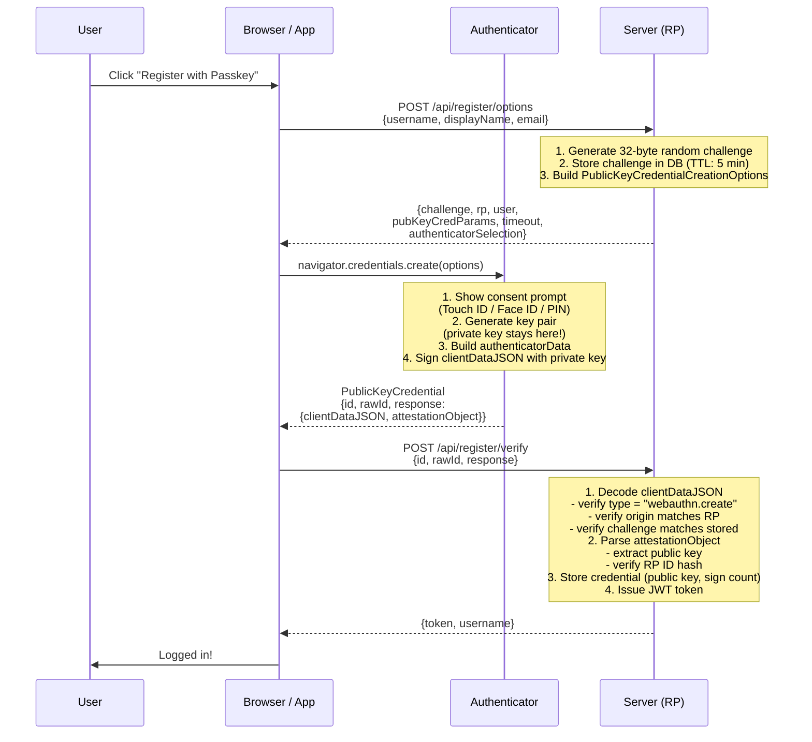
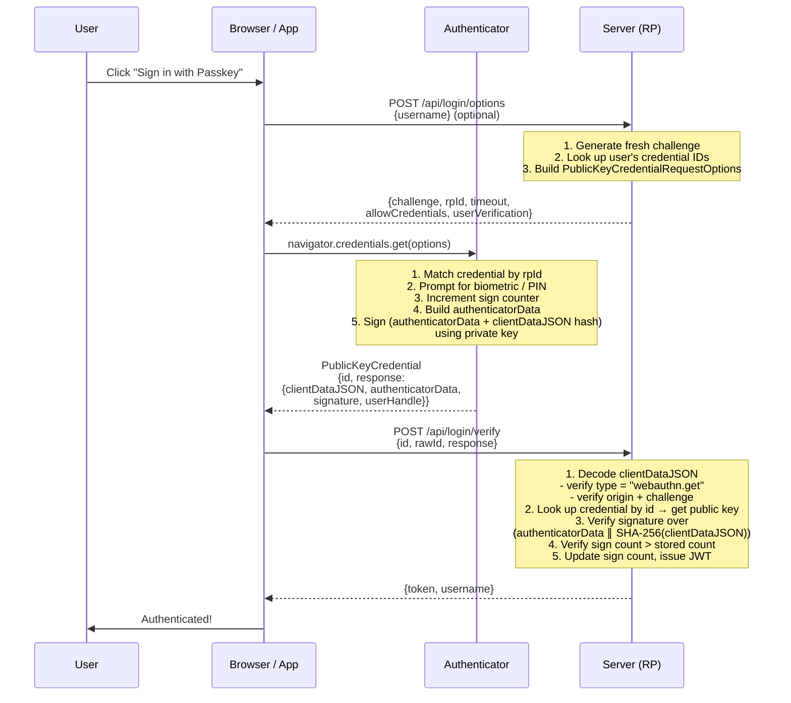

# FIDO2 Demo Platform

A full-stack demo system for passwordless authentication using **FIDO2 / WebAuthn passkeys**.
Built to make the protocol tangible — you can register a passkey, authenticate with it,
inspect the raw WebAuthn JSON messages, and manage credentials across web and mobile.

---

## Table of Contents

1. [How FIDO2 Works](#how-fido2-works)
   - [The Big Picture](#the-big-picture)
   - [Key Actors](#key-actors)
   - [Core Concepts](#core-concepts)
   - [Registration Flow](#registration-flow)
   - [Authentication Flow](#authentication-flow)
   - [Security Properties](#security-properties)
2. [System Architecture](#system-architecture)
3. [Project Structure](#project-structure)
4. [Environment Setup](#environment-setup)
5. [Running the System](#running-the-system)
6. [Mobile App Configuration](#mobile-app-configuration)
7. [Verifying the backend is running](#verifying-the-backend-is-running)
8. [API Reference](#api-reference)
9. [Tech Stack](#tech-stack)

---

## How FIDO2 Works

### The Big Picture

**FIDO2** is an open authentication standard that replaces passwords with public-key cryptography.
Instead of sending a secret (a password) to a server to prove who you are, your device performs
a cryptographic *signing* operation — the private key never leaves your device.

```
  Passwords (old)              FIDO2 / Passkeys (new)
  ──────────────────────────   ──────────────────────────────────
  You → server: "my secret     You → device: biometric/PIN
  is hunter2"                  Device → server: signed proof
                                                   ↑
  Server stores a hash that    Server stores your PUBLIC key
  can be cracked or leaked     (worthless without the device)
```

FIDO2 is composed of two specifications:

| Spec | Role |
|------|------|
| **W3C WebAuthn** | Browser/app API — how clients interact with authenticators |
| **CTAP2** (Client-to-Authenticator Protocol) | How the browser talks to a hardware key (YubiKey, etc.) |

**Passkey** = a FIDO2 credential stored in the OS/cloud keychain (iCloud Keychain, Google Password Manager),
making it synced across your devices — same security, better UX.

---

### Key Actors

```
┌─────────────────────────────────────────────────────────────────┐
│                                                                 │
│   ┌─────────────┐    WebAuthn API    ┌──────────────────────┐   │
│   │             │◄──────────────────►│                      │   │
│   │   Browser   │                   │    Authenticator      │   │
│   │  (Client)   │    CTAP2 (USB/    │  (TouchID, FaceID,   │   │
│   │             │◄── NFC/BLE) ─────►│   YubiKey, Windows   │   │
│   └──────┬──────┘                   │   Hello, Passkey)    │   │
│          │                          └──────────────────────┘   │
│          │ HTTPS                                                │
│          ▼                                                      │
│   ┌─────────────┐                                              │
│   │             │                                              │
│   │  Relying    │  ← Your backend server                       │
│   │   Party     │    (this demo: Spring Boot)                  │
│   │  (Server)   │                                              │
│   └─────────────┘                                              │
│                                                                 │
└─────────────────────────────────────────────────────────────────┘
```

| Actor | What it does |
|-------|-------------|
| **Relying Party (RP)** | Your server. Generates challenges, stores public keys, verifies signatures |
| **Authenticator** | The device/key that holds private keys and performs biometric verification |
| **Client (Browser/App)** | Mediates between RP and authenticator using the WebAuthn API |

---

### Core Concepts

| Concept | Meaning |
|---------|---------|
| **RP ID** | Domain of the server (e.g. `example.com`). Credentials are scoped to this domain — a phishing site at `examp1e.com` cannot use your credential |
| **Challenge** | A random nonce generated fresh for each ceremony. Prevents replay attacks |
| **Credential ID** | A handle that identifies a specific key pair on an authenticator |
| **Public Key** | Stored by the server. Used to verify signatures |
| **Private Key** | Stays on the authenticator forever. Used to create signatures |
| **User Verification (UV)** | Authenticator confirms user identity (biometric, PIN). Can be `required`, `preferred`, or `discouraged` |
| **Attestation** | Optional: the authenticator proves its make/model to the server during registration |
| **Assertion** | What the authenticator produces during login — a signed proof |
| **Sign Count** | Monotonically incrementing counter. If the counter goes backwards, the credential may have been cloned |
| **Discoverable Credential** | A passkey stored in the authenticator's resident key storage — allows login without typing a username |

---

### Registration Flow

A user registers a passkey for the first time:



**What happens inside `clientDataJSON`:**
```json
{
  "type": "webauthn.create",
  "challenge": "abc123...",
  "origin": "https://example.com",
  "crossOrigin": false
}
```

**What happens inside `attestationObject`:**
```
CBOR-encoded:
{
  fmt: "none",           ← attestation format
  attStmt: {},           ← attestation statement (empty for "none")
  authData: <bytes>      ← authenticator data (see below)
}
```

**AuthenticatorData structure:**
```
┌──────────────┬────┬────┬─────────────┬──────────────────────┐
│ rpIdHash     │ FL │ SC │ AAGUID      │ Public Key (COSE)    │
│ (32 bytes)   │ AG │    │ (16 bytes)  │                      │
│ SHA-256 of   │ S  │    │ authenticator│ EC P-256 or          │
│ "example.com"│    │    │ model ID    │ RSA-2048             │
└──────────────┴────┴────┴─────────────┴──────────────────────┘
  FL = flags byte: bit 0 = User Present, bit 2 = User Verified,
                   bit 6 = Attested Credential Data included
  SC = sign count (4 bytes, big-endian)
```

---

### Authentication Flow

The user signs in using their registered passkey:



**Signature verification (step 3 on server):**
```
Signed data = authenticatorData bytes
            ∥ SHA-256(clientDataJSON bytes)

Server verifies: ECDSA.verify(publicKey, signedData, signature)
```

---

### Security Properties

```
┌────────────────────────────────────────────────────────────────┐
│  Threat                  │  How FIDO2 protects you             │
├────────────────────────────────────────────────────────────────┤
│  Password breach         │  No password exists to steal        │
│  Phishing site           │  Origin bound: rpId verified in     │
│                          │  hardware, fake site gets nothing   │
│  Replay attack           │  Fresh challenge each time,         │
│                          │  consumed once on verify            │
│  MITM / credential relay │  TLS + origin binding               │
│  Credential stuffing     │  Unique key per site, no reuse      │
│  Cloned authenticator    │  Sign counter detection             │
│  Server breach           │  Public key only — useless alone    │
└────────────────────────────────────────────────────────────────┘
```

**Why the challenge matters:**
```
Without challenge:    Attacker intercepts signature → replays it later  ✗
With fresh challenge: Signature is valid for THIS request only          ✓
```

**Why origin binding matters:**
```
User is on: https://evil-bank.com (phishing)
RP ID set:  evil-bank.com

Authenticator signs with origin = "https://evil-bank.com"
Server for real-bank.com checks: origin must be "https://real-bank.com"
                                  → REJECTED ✓
```

---

## System Architecture

```
                            Internet
                               │
                          ┌────┴────┐
                          │  Nginx  │  :80
                          └────┬────┘
                               │
                ┌──────────────┴──────────────┐
                │                             │
         /api/* │                        /* ──┘
                ▼                             ▼
     ┌──────────────────┐         ┌───────────────────┐
     │   Spring Boot    │         │    React Web App   │
     │   Backend API    │         │   (Vite + Tailwind)│
     │   :8080          │         │   :3000            │
     └────────┬─────────┘         └───────────────────┘
              │
              ▼
     ┌──────────────────┐
     │      MySQL       │
     │   :3306          │
     │                  │
     │  users           │
     │  credentials     │
     │  challenges      │
     │  login_history   │
     └──────────────────┘

     React Native App (separate)
     ──────────────────────────
     iOS / Android  →  hits backend directly
     Uses react-native-passkey for native
     platform passkey API
```

**Data flow for a login:**
```
Mobile/Web                  Nginx              Spring Boot         MySQL
    │                          │                    │                │
    │── POST /api/login/opts──►│── forward ─────────►│                │
    │                          │                    │── SELECT ──────►│
    │                          │                    │◄── credentials ─│
    │◄── {challenge, ...} ─────│◄────────────────── │                │
    │                          │                    │                │
    │  [user touches finger]   │                    │                │
    │                          │                    │                │
    │── POST /api/login/verify►│── forward ─────────►│                │
    │                          │                    │── verify sig   │
    │                          │                    │── UPDATE count►│
    │◄── {JWT token} ──────────│◄────────────────── │                │
```

---

## Project Structure

```
fido2/
├── README.md
├── FIDO2_Demo_Platform_Plan.md
├── docker-compose.yml              ← orchestrates all services
│
├── backend/                        ← Spring Boot 3 (Java 17)
│   ├── Dockerfile
│   ├── pom.xml
│   └── src/main/java/com/fido2demo/
│       ├── Fido2DemoApplication.java
│       ├── config/
│       │   ├── SecurityConfig.java       ← JWT filter chain, CORS
│       │   ├── WebAuthnConfig.java       ← RP identity, allowed origins
│       │   └── GlobalExceptionHandler.java
│       ├── controller/
│       │   ├── RegistrationController.java
│       │   ├── AuthenticationController.java
│       │   ├── UserController.java
│       │   └── WellKnownController.java  ← Digital Asset Links for mobile passkeys
│       ├── service/
│       │   ├── RegistrationService.java  ← registration ceremony
│       │   ├── AuthenticationService.java← authentication ceremony
│       │   ├── UserService.java
│       │   └── ChallengeService.java     ← challenge lifecycle + cleanup
│       ├── entity/          ← JPA entities (User, Credential, Challenge, LoginHistory)
│       ├── repository/      ← Spring Data JPA repositories
│       ├── dto/             ← request/response DTOs
│       ├── security/        ← JwtUtil, JwtAuthFilter
│       ├── webauthn/        ← DatabaseCredentialRepository (Yubico interface impl)
│       └── util/            ← UserAgentParser
│   └── src/main/resources/
│       ├── application.yml
│       └── db/migration/V1__init_schema.sql
│
├── fido2-demo-web/                 ← React 19 + Vite + Tailwind CSS
│   ├── Dockerfile
│   ├── nginx.conf                  ← SPA fallback routing
│   └── src/
│       ├── App.tsx                 ← router + QueryClient + auth guard
│       ├── lib/
│       │   ├── api.ts              ← axios instance with JWT interceptor
│       │   ├── store.ts            ← Zustand auth store (persisted)
│       │   └── webauthn.ts         ← navigator.credentials wrappers
│       └── pages/
│           ├── HomePage.tsx
│           ├── RegisterPage.tsx
│           ├── LoginPage.tsx
│           ├── DashboardPage.tsx
│           ├── CredentialsPage.tsx
│           ├── ProfilePage.tsx
│           └── ProtocolViewerPage.tsx  ← inspect raw WebAuthn messages
│
├── fido2-demo-mobile/              ← Expo 56 + React Native 0.85
│   └── src/
│       ├── app/
│       │   ├── _layout.tsx         ← root layout + QueryClient + auth guard
│       │   ├── index.tsx           ← splash + redirect
│       │   ├── login.tsx
│       │   ├── register.tsx
│       │   └── (tabs)/
│       │       ├── _layout.tsx     ← tab bar for authenticated screens
│       │       ├── dashboard.tsx
│       │       ├── credentials.tsx
│       │       └── profile.tsx
│       └── lib/
│           ├── config.ts             ← API host, port, WebAuthn rpId
│           ├── api.ts                ← axios + JWT interceptor + request/response logging
│           ├── store.ts              ← Zustand (AsyncStorage persist)
│           └── passkey.ts            ← react-native-passkey wrappers (Passkey.create / Passkey.get)
│
└── nginx/
    └── nginx.conf                  ← reverse proxy config
```

---

## Environment Setup

### Prerequisites

| Tool | Version | Install |
|------|---------|---------|
| Java (JDK) | 17+ | [Adoptium](https://adoptium.net) or `brew install --cask temurin@17` |
| Maven | 3.9+ | `brew install maven` |
| Node.js | 20+ | `brew install node` |
| Bun | latest | `curl -fsSL https://bun.sh/install \| bash` |
| Docker Desktop | latest | [docker.com](https://www.docker.com/products/docker-desktop) |
| Xcode (iOS) | 15+ | App Store (for mobile simulator) |
| Android Studio | latest | [developer.android.com](https://developer.android.com/studio) |

### Verify installation

```bash
java -version        # openjdk 17+ or 21+
mvn -version         # Apache Maven 3.9+
node --version       # v20+
bun --version        # 1.x
docker --version     # Docker 24+
```

### Backend — first time setup

```bash
cd backend
mvn dependency:go-offline   # pre-download all Maven dependencies (~300 MB)
```

### Web — first time setup

```bash
cd fido2-demo-web
bun install
```

### Mobile — first time setup

```bash
cd fido2-demo-mobile
bun install
```

For iOS, also install CocoaPods dependencies:

```bash
cd fido2-demo-mobile
npx expo run:ios          # auto-installs pods on first run
```

---

## Running the System

### Option 1 — Docker Compose (full stack, recommended)

Runs everything: MySQL + Spring Boot + React web + Nginx.

```bash
# From project root
docker compose up --build

# Services:
#   http://localhost       → Nginx → React web app
#   http://localhost/api/  → Nginx → Spring Boot API
#   http://localhost:8080  → Spring Boot directly
#   localhost:3306         → MySQL
```

The backend container defaults to `RP_ID=192.168.1.11` for mobile passkey testing on your LAN. Override in `docker-compose.yml` or set `RP_ID=localhost` if you only need the web app during local development.

Stop:
```bash
docker compose down          # keep data
docker compose down -v       # also wipe MySQL volume
```

### Option 2 — Local development (hot reload)

**Step 1 — Start MySQL**
```bash
docker compose up mysql -d
```

Or use an existing local MySQL:
```sql
CREATE DATABASE fido2demo;
CREATE USER 'fido2user'@'localhost' IDENTIFIED BY 'fido2pass';
GRANT ALL PRIVILEGES ON fido2demo.* TO 'fido2user'@'localhost';
```

**Step 2 — Start the backend**
```bash
cd backend
mvn spring-boot:run

# API available at http://localhost:8080
# Flyway runs migrations automatically on startup
```

Environment variables you can override (defaults shown):
```bash
DB_HOST=localhost
DB_PORT=3306
DB_NAME=fido2demo
DB_USER=fido2user
DB_PASSWORD=fido2pass
JWT_SECRET=fido2-demo-secret-key-change-in-production-at-least-256-bits
RP_ID=192.168.1.11
RP_NAME="FIDO2 Demo"
RP_ORIGINS=http://192.168.1.11:8080,http://192.168.1.11,http://localhost:5173,http://localhost:3000,http://localhost
ANDROID_PACKAGE=com.fido2demo.mobile
ANDROID_CERT_FINGERPRINTS=FA:C6:17:45:DC:09:03:78:6F:B9:ED:E6:2A:96:2B:39:9F:73:48:F0:BB:6F:89:9B:83:32:66:75:91:03:3B:9C
```

> **RP ID note:** Passkeys are scoped to the RP ID. The default (`192.168.1.11`) is set up for mobile testing on a local network. For **web-only** development in the browser, override with `RP_ID=localhost` when starting the backend. Web and mobile credentials are not interchangeable unless they share the same RP ID.

**Step 3 — Start the web frontend**
```bash
cd fido2-demo-web
bun dev

# App at http://localhost:5173
# /api/* proxied to http://localhost:8080 automatically
```

**Step 4 — Start the mobile app**

For iOS simulator:
```bash
cd fido2-demo-mobile
bun ios
```

For Android emulator or a physical device:
```bash
bun android
```

> **Note:** `react-native-passkey` requires a **native development build** — it does not work in Expo Go.
> The first `bun ios` / `bun android` will build the native shell (takes a few minutes).

See [Mobile App Configuration](#mobile-app-configuration) for API host, RP ID, and passkey setup on real devices.

---

## Mobile App Configuration

### Central config file

Edit `fido2-demo-mobile/src/config.ts` to point at your backend and WebAuthn RP ID:

```typescript
const API_HOST = '192.168.1.11'   // your machine's LAN IP
const API_PORT = 8080

export const config = {
  api: {
    host: API_HOST,
    port: API_PORT,
    baseUrl: process.env.EXPO_PUBLIC_API_URL ?? `http://${API_HOST}:${API_PORT}`,
  },
  webauthn: {
    rpId: process.env.EXPO_PUBLIC_RP_ID ?? API_HOST,
  },
}
```

The mobile app reads API URL and RP ID from here. Override at runtime with:

```bash
EXPO_PUBLIC_API_URL=http://192.168.1.11:8080 EXPO_PUBLIC_RP_ID=192.168.1.11 bun android
```

Keep `config.webauthn.rpId` in sync with the backend `RP_ID`. After changing either value, restart the backend and rebuild the mobile app.

### Passkeys on a real device

Passkeys require a **physical device** (or iOS 16+ simulator). Native passkeys do **not** work with `rpId: localhost` on a phone — `localhost` refers to the device itself, not your dev machine.

**Checklist for Android:**

1. Set your machine's LAN IP in `src/config.ts` and backend `RP_ID`
2. Restart the backend so `/api/login/options` returns the correct `rpId`
3. Verify Digital Asset Links are served:
   ```bash
   curl http://192.168.1.11:8080/.well-known/assetlinks.json
   ```
4. Rebuild the native app: `npx expo run:android`
5. **Register a passkey on the device** — credentials created in the web browser are stored separately and cannot be used by the native app
6. Sign in with the passkey prompt (leave username blank for discoverable login, or use a user registered on this device)

**Checklist for iOS:**

1. Match `RP_ID` and `config.webauthn.rpId` to your server host
2. Set Associated Domains in `app.json`: `webcredentials:<your-host>`
3. Serve `/.well-known/apple-app-site-association` from your backend (HTTPS recommended; use ngrok or a real domain for production-like testing)
4. Rebuild: `npx expo run:ios`

**Android build settings** (in `app.json` via `expo-build-properties`):

- `compileSdkVersion: 36` — required by recent AndroidX dependencies
- `minSdkVersion: 28` — minimum for `react-native-passkey`
- `usesCleartextTraffic: true` — allows HTTP to a local backend during development

### react-native-passkey API

The library uses WebAuthn-style method names:

| Purpose | Method |
|---------|--------|
| Register | `Passkey.create(...)` |
| Sign in | `Passkey.get(...)` |

### API request logging

The mobile axios client logs every request and response to the Metro console:

```
[REQUEST]  {full URL} {headers} {body}
[RESPONSE] {full URL} {headers} {body}
```

### Troubleshooting mobile passkeys

| Symptom | Likely cause | Fix |
|---------|--------------|-----|
| `Passkey.get()` hangs, no UI | `rpId` is `localhost` on a physical device | Set `RP_ID` and `config.webauthn.rpId` to your LAN IP; restart backend |
| No error shown on failure | Passkey errors are plain objects, not `Error` | Check Metro logs; the app surfaces `message` from passkey errors in alerts |
| Login finds no passkey | Credential was registered on web, not on phone | Register again from the mobile app |
| Build fails on AndroidX metadata | `compileSdk` too low | Ensure `compileSdkVersion: 36` in `app.json` |
| App cannot reach backend | Wrong IP or firewall | Confirm `curl http://<IP>:8080/api/health` from the device network |

For local web development, browsers treat `localhost` as a secure context and passkeys work without Digital Asset Links. That does **not** apply to the native mobile app.

## Verifying the backend is running

```bash
curl http://localhost:8080/api/health
# → OK

curl -X POST http://localhost:8080/api/register/options \
  -H "Content-Type: application/json" \
  -d '{"username":"alice","displayName":"Alice","email":"alice@example.com"}'
# → {"challenge":"...","rp":{...},"user":{...},...}

# Mobile passkey setup — Digital Asset Links (Android)
curl http://192.168.1.11:8080/.well-known/assetlinks.json
# → [{"relation":["delegate_permission/common.handle_all_urls",...],"target":{...}}]
```

Replace `192.168.1.11` with your machine IP if different.

---

## API Reference

All endpoints are prefixed with `/api`. Protected endpoints require `Authorization: Bearer <jwt>`.

### Registration

```
POST /api/register/options          public
POST /api/register/verify           public
```

### Authentication

```
POST /api/login/options             public
POST /api/login/verify              public
```

### User (protected)

```
GET  /api/me
PUT  /api/me
GET  /api/credentials
DELETE /api/credentials/{id}
GET  /api/login-history?page=0&size=20
```

### Health

```
GET  /api/health                    public → "OK"
```

### Well-known (mobile passkey association)

```
GET  /.well-known/assetlinks.json   public → Android Digital Asset Links
```

Configure via `ANDROID_PACKAGE` and `ANDROID_CERT_FINGERPRINTS` in the backend environment. The default fingerprint matches the Expo/Android debug keystore.

---

## Tech Stack

| Layer | Technology |
|-------|-----------|
| Mobile | React Native 0.85 · Expo 56 · Expo Router · react-native-passkey |
| Web | React 19 · Vite 8 · Tailwind CSS v4 · TanStack Query · Zustand |
| Backend | Spring Boot 3.3 · Java 17 · Spring Security · Spring Data JPA |
| WebAuthn | Yubico webauthn-server-core 2.5 |
| Auth tokens | JJWT 0.12 (HS256 JWT) |
| Database | MySQL 8 · Flyway migrations |
| Proxy | Nginx |
| Container | Docker Compose |

---

## Demo Features

| Feature | Web | Mobile |
|---------|-----|--------|
| Passkey registration | ✅ | ✅ |
| Passkey login | ✅ | ✅ |
| Credential management (list, delete) | ✅ | ✅ |
| Login history | ✅ | ✅ |
| Profile update | ✅ | ✅ |
| Protocol viewer (raw WebAuthn JSON) | ✅ | — |
| Multi-device login | ✅ (passkey sync) | ✅ |
| Security key support | ✅ | ✅ |
